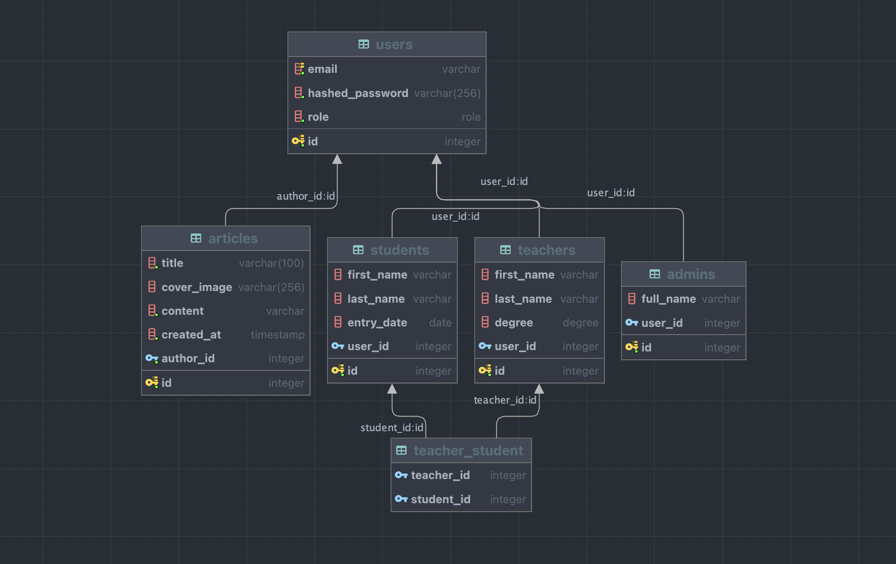

# Developer test task

## Tech stack

1. Python 3.10
2. [Fast API](https://fastapi.tiangolo.com)
3. [SQLAlchemy v2.0](https://www.sqlalchemy.org)
4. PostgreSQL
5. [pytest](https://docs.pytest.org/en/7.2.x/)

## Description

Relations between tables are described in the following diagram:

